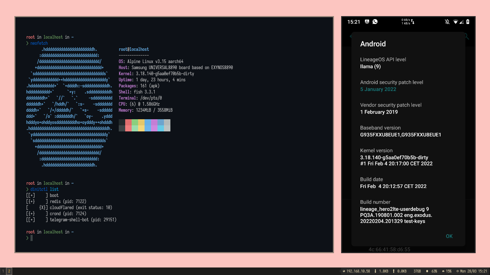

# charch_dinit
Initialize Dinit init for the default ChArch rootfs instance.



Tanks to https://github.com/tytydraco/ChArch for best work my favorit chroot
scipt for my android devices

Here I use dinit as my main container init tanks https://github.com/davmac314/dinit work perfect in my android, Simple and works well

my best os chroot os is https://armtixlinux.org/ and https://alpinelinux.org/

> Submit issue for question or Submit error

Use my original repo for any latest update

https://github.com/mohamad-supangat/charch_dinit

## INSTALL GUIDE
- install charch module in magisk
  https://github.com/Magisk-Modules-Alt-Repo/charch
- install this module
- run mkarch to make chroot env, see sample from charch readme.md:
  ```bash
  mkarch -U https://dl-cdn.alpinelinux.org/alpine/v3.15/releases/aarch64/alpine-minirootfs-3.15.0-aarch64.tar.gz
  ```
- install https://github.com/davmac314/dinit in chroot env
- make 	/usr/bin/dinit-init executable, sample
  ```bash
  ln -s /usr/bin/dinit /usr/bin/dinit-init
  ```
- follow https://github.com/davmac314/dinit guide for make service configuration, or you can see or clone https://github.com/mohamad-supangat/dinit.d my dinit config for my chroot env
- now every time you reboot the phone the dinit service will run automatically
